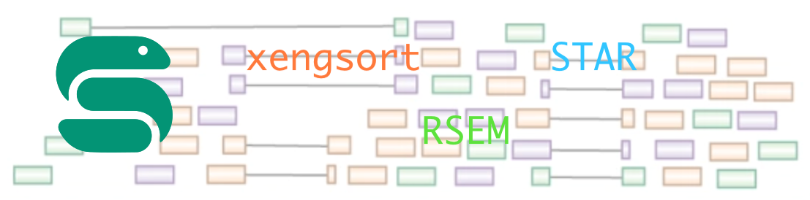

[![LinkedIn][linkedin-shield]][linkedin-url]

<!-- PROJECT LOGO -->
 

  
  <h3 align="center"> Flexible Snakemake-based pipeline for PDX or human RNAseq reads</h3>

  

    STAR-RSEM based quantification
     

<!-- TABLE OF CONTENTS -->

  
Table of Contents

  <ol>
    <li>
      <a href="#about">About</a></li>
    <li>
      <a href="#pipeline-structure">Pipeline structure</a>
    </li>
    <li>
      <a href="#prerequisites">Prerequisites</a>
    </li>
    <li><a href="#usage">Usage</a></li>
    <li><a href="#contact">Contact</a></li>
    <li><a href="#acknowledgments">Acknowledgments</a></li>
  </ol>

<!-- ABOUT THE PROJECT -->
## About

This pipeline is desgined to process and quantify paired-end Illumina RNAseq reads from patient derived xenograft (PDX) data. As an added option it also runs in basic RNAseq mode for standard human input data. With the exception of reference genomes and indices for xengsort, star and rsem the pipeline functions as a standalone package. 

(<a href="#readme-top">back to top</a>)

<!-- PIPELINE STRUCTURE -->
## Pipeline structure

RNA seq mode
1. [FastQC](https://github.com/s-andrews/FastQC)
2. [STAR](https://github.com/alexdobin/STAR)
3. [RSEM](https://github.com/deweylab/RSEM)
4. [MultiQC](https://github.com/ewels/MultiQC)

Xenograft mode
1. [FastQC](https://github.com/s-andrews/FastQC)
2. [Trim Galore](https://github.com/FelixKrueger/TrimGalore)
3. [Xengsort](https://gitlab.com/genomeinformatics/xengsort)
4. [STAR](https://github.com/alexdobin/STAR)
5. [RSEM](https://github.com/deweylab/RSEM)
6. [MultiQC](https://github.com/ewels/MultiQC)

(<a href="#readme-top">back to top</a>)

<!-- PREREQUISITES -->
## Prerequisites

* A conda environment built using the provided environment.yaml file. (Will also work with a Docker/Singularity container built with identical package list, a working Dockerfile has been provided.)
* Purpose appropriate reference indices for STAR and RSEM generated with [genomeGenerate](https://physiology.med.cornell.edu/faculty/skrabanek/lab/angsd/lecture_notes/STARmanual.pdf) mode and [rsem-prepare-reference](https://github.com/deweylab/RSEM#i-preparing-reference-sequences) respectively.
* Reference cDNA files for building xengsort reference.

(<a href="#readme-top">back to top</a>)

<!-- USAGE -->
## Usage

Clone the repo which will then act as a functional working directory.

Run the prepare script which creates necessary directories and generates symbolic links to raw data input files. 

    bash prepare.sh path/to/data/directory/

Configure parameters in config.yaml
* Key parameters to set:
    * mode: Either ‘rnaseq’ or ‘xenograft’
    * samples: samples file
    * data_dir: raw data directory
    * result_dir: premade results directory
    * star_index_dir
    * rsem_reference
    * xeng_ref: necessary if processing xenograft data
    * xeng_cdna_human
    * xeng_cdna_mouse

* For trim_galore, star_2_pass and rsem_calculate_expression parameters, there is an option to manually add parameters into the ‘extra’ field. If an option is set to False, it is not entered into the final params string. If set to True, a double dash will be appended and the option will be set, this is particularly useful for option flags with no value. If given a value, then the entire option + value will be entered. It is programmed to be redundant so empty strings or no values will be interpreted as such.

Run snakemake dry-run to verify correct inputs and outputs.

    snakemake -n --debug-dag

Run a full pass.

    snakemake --cores 16 --retries 3 --rerun-incomplete --jobs 5

The retries flag is there to activate the oom handling feature in snakemake, if STAR runs oom the pipeline will automatically retry with an additional 10% and 25% on the 2nd and 3rd retries. rerun-incomplete functions as a failsafe to make sure all jobs are complete if there is a need to re-run the pipeline upon failure. Finally, the jobs flag controls the number of concurrent running jobs, you may tweak depending on the resources available. 

(<a href="#readme-top">back to top</a>)

<!-- BENCHMARKS -->
## Benchmarks

The pipeline was tested on a simulated dataset containing an even 50 50 split of mouse and human DNA containing 93361723 reads. Total run time for the sample dataset was 1 hour and 21 minutes given 16 cores on a modern HPC workstation.

(<a href="#readme-top">back to top</a>)

<!-- CONTACT -->
## Contact

Kenneth Chow - kennethchowsk@gmail.com

Project Link: [https://github.com/kennethchow/snakemake-star-xengsort-rsem](https://github.com/kennethchow/snakemake-star-xengsort-rsem)

(<a href="#readme-top">back to top</a>)

<!-- ACKNOWLEDGMENTS -->
## Acknowledgments

* [Snakemake](https://github.com/snakemake/snakemake)
* [FastQC](https://github.com/s-andrews/FastQC)
* [Trim Galore](https://github.com/FelixKrueger/TrimGalore)
* [Xengsort](https://gitlab.com/genomeinformatics/xengsort)
* [STAR](https://github.com/alexdobin/STAR)
* [RSEM](https://github.com/deweylab/RSEM)
* [MultiQC](https://github.com/ewels/MultiQC)

(<a href="#readme-top">back to top</a>)

<!-- MARKDOWN LINKS & IMAGES -->

[linkedin-shield]: https://img.shields.io/badge/-LinkedIn-black.svg?style=for-the-badge&logo=linkedin&colorB=555
[linkedin-url]: https://linkedin.com/in/kenneth-chow